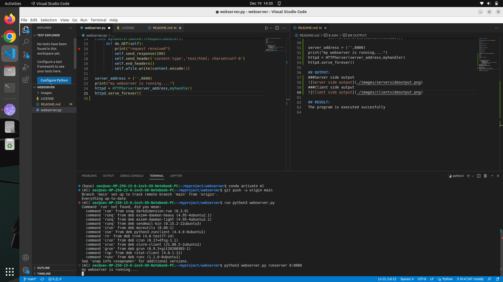
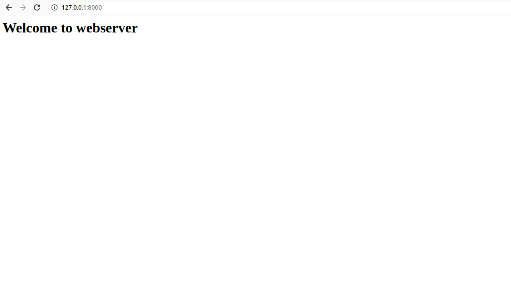

# Developing a Simple Webserver

# AIM:

To develop a simple webserver to serve html programming pages.

## DESIGN STEPS:

### Step 1:

HTML content creation is done

### Step 2:

Design of webserver workflow

### Step 3:

Implementation using Python code

### Step 4:

Serving the HTML pages.

### Step 5:

Testing the webserver

## PROGRAM:
```
from http.server import HTTPServer,BaseHTTPRequestHandler

content="""
<html>
<head>
</head>
<body>
<h1> Welcome to webserver</h1>
</body>
</html>
"""


class myhandler(BaseHTTPRequestHandler):
     def do_GET(self):
         print("request received")
         self.send_response(200)
         self.send_header('content-type','text/html; charset=utf-8')
         self.end_headers()
         self.wfile.write(content.encode())

server_address = ('',8000)
print("my webserver is running....")
httpd = HTTPServer(server_address,myhandler)
httpd.serve_forever()
```
## OUTPUT:
###Server side output

###Client side output


## RESULT:
The program is executed succesfully
